<!-- @format -->

# non managed multi-k8s and CI/CD

how I created this cluster and integrate Github Action

1.  Create a VPC
    - create Public Subnet
      - Edit subnet settings
        - enable public IP
        - enable NAT
    - Internet Gateways
      - attach VPC with Internet Gateway
    - Route table
      - Edit subnet associations
      - create route to Internet Gateway
2.  Create four EC2 instances.
    - Choose AMI
    - Choose Instance Type
    - configure instance
    - Add storage
    - create a security group
    - create a key pair
    - Each instance should have a public IP address.
3.  Set up Kubernetes on each EC2 instance.
    - set security group rules
      - Edit inbound rules
    - one intance for Master Node
    - two instance for Worker Node
4.  Create a load balancer with EC2.
5.  Github Action add self hosted runner
    - Create self-hosted runner
    - Configuring the self-hosted runner application as a service
6.  deploy the application on the Master Node

# Create a VPC

I create a VPC and I add CIDR 20.0.0.0/16

### VPC IP Address

**VPC: IP Address (20.20.0.0/16)**

<a href="./images/create-vpc.png">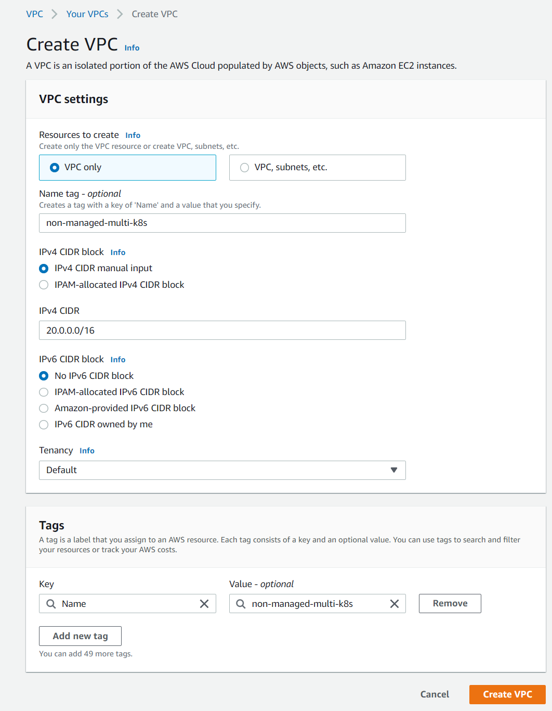</a>

## create Public Subnet

**Subnet: IP Address (20.20.1.0/24)**

<a href="./images/create-public-subnet.png">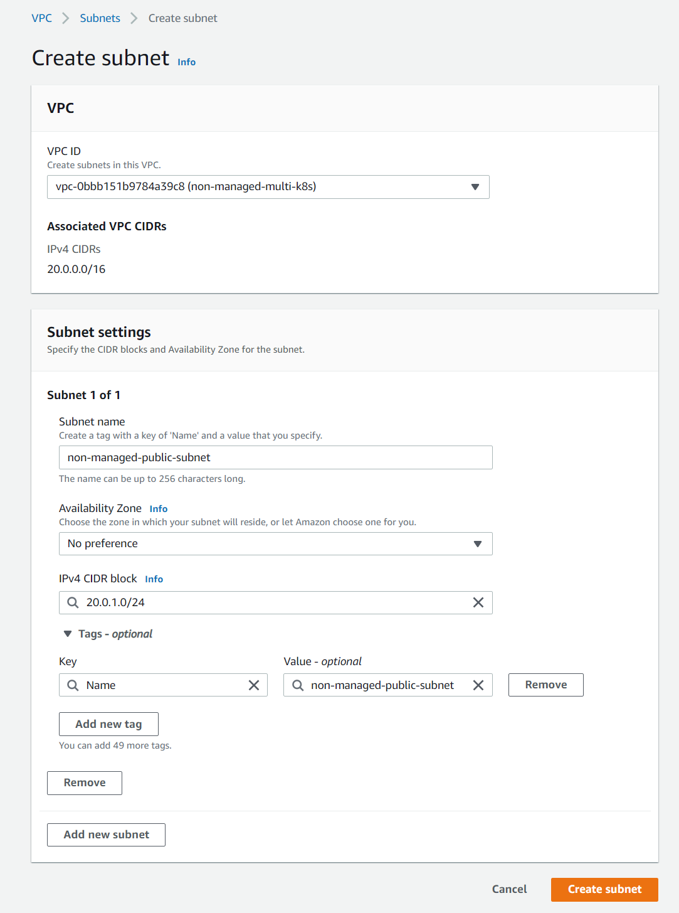</a>

## Edit subnet settings

- ### enable public IP

- ### enable _RBN_

<a href="./images/edit-subnet-settings.png">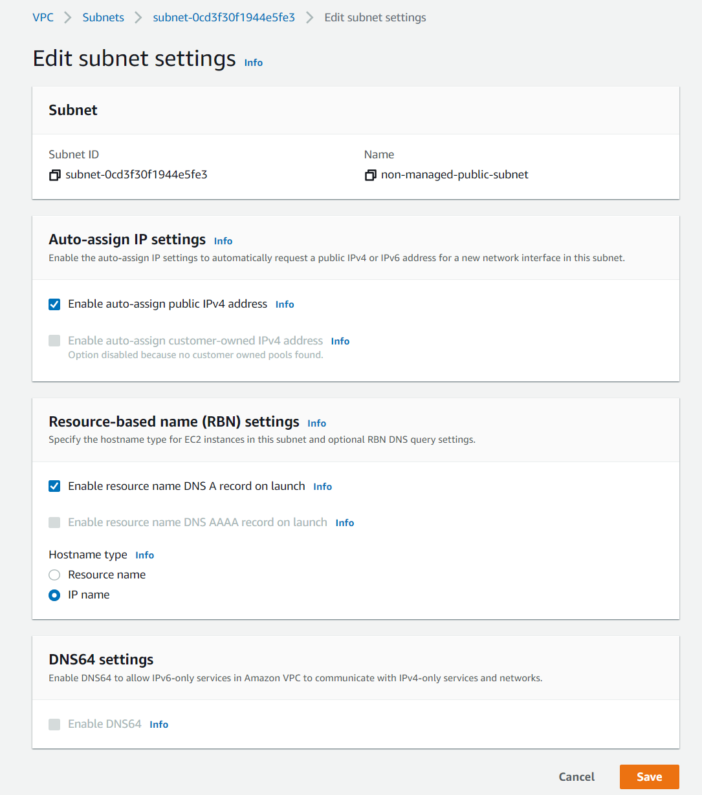</a>

## Internet Gateways

<a href="./images/create-igw.png">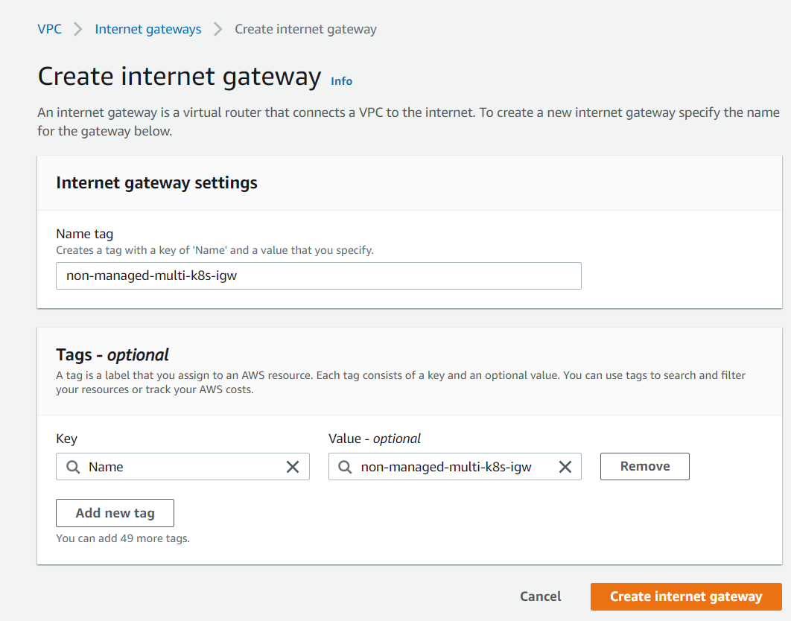</a>

## attach VPC with Internet Gateway

<a href="./images/attach-vpc.png">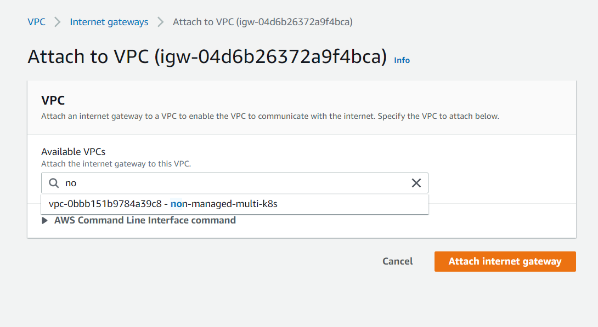</a>

# Route table

<a href="./images/create-route-table.png">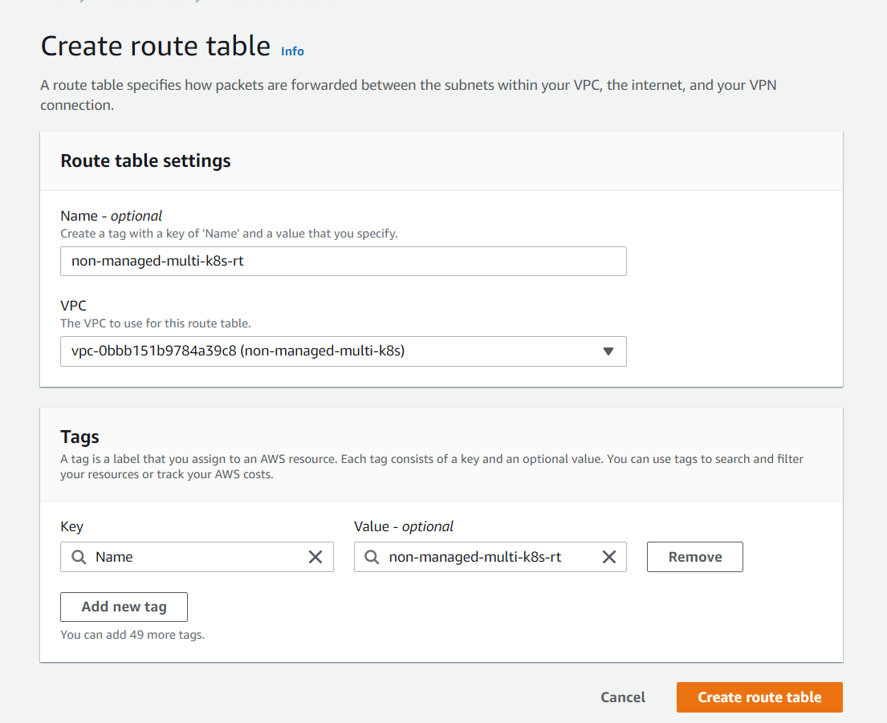</a>

## Edit subnet associations

<a href="./images/edit-subnet-associations.png">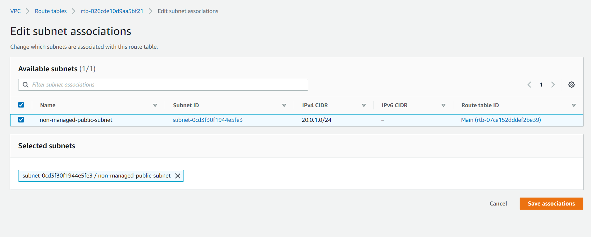</a>

# create route to Internet Gateway

<a href="./images/create-route-to-Internet-gateway.png">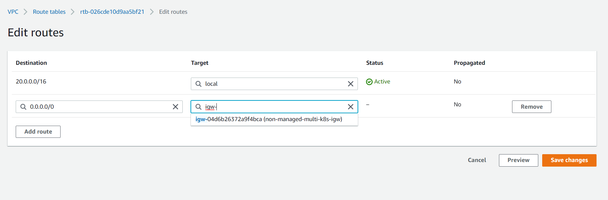</a>

# Create four EC2 instances.

_we use ubuntu ec2 instance_

### Choose AMI

<a href="./images/choose-ami.png">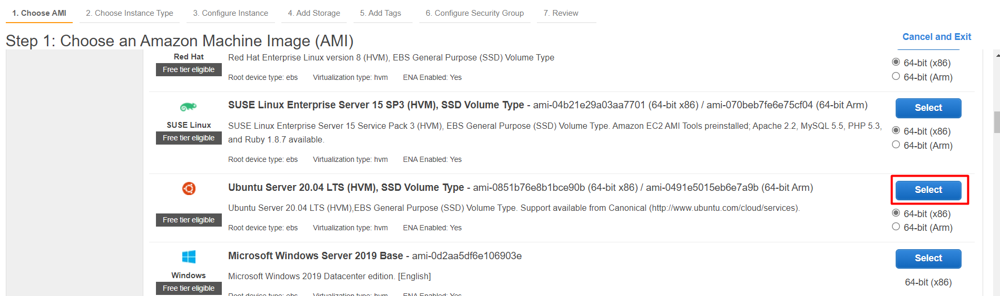</a>

### Choose Instance Type

<a href="./images/choose-instance-type.png">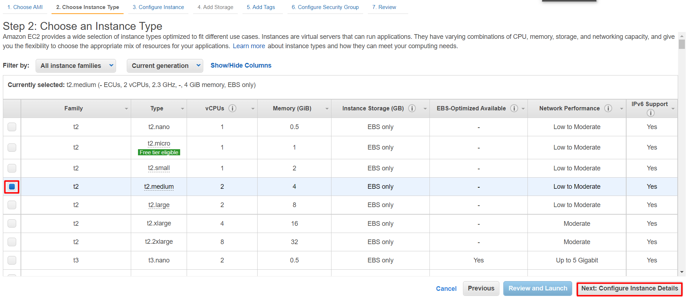</a>

### configure instance

<a href="./images/configure-instance.png"></a>

### Add storage

<a href="./images/add-storage.png">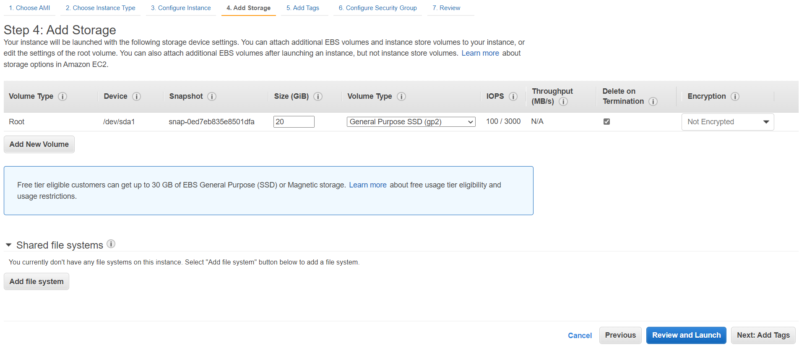</a>

### create a key pair and last part of the instance

<a href="./images/review.png">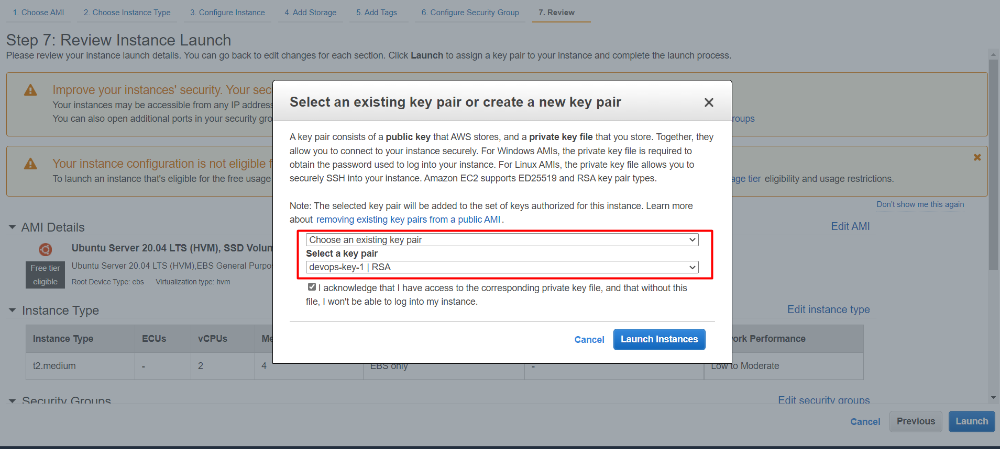</a>

# Set up Kubernetes on each EC2 instance.

### set security group rules

- ### Edit inbound rules

<a href="./images/edit-inbound-rules.png">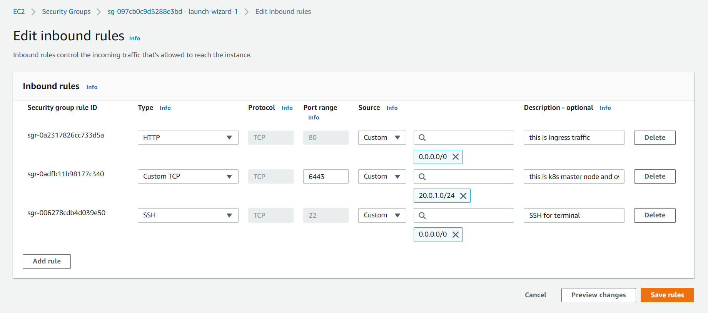</a>

ssh your master node

    ssh -i ./devops-key-1.pem ubuntu@YOUR_PUBLIC_IP_ADDRESS

ssh your worker-1 node

    ssh -i ./devops-key-1.pem ubuntu@YOUR_PUBLIC_IP_ADDRESS

ssh your worker-2 node

    ssh -i ./devops-key-1.pem ubuntu@YOUR_PUBLIC_IP_ADDRESS

### after you install this package

[install k8s ](https://gist.github.com/hamzazahidulislam/2c7e26b70b4988be08051ff9be49566b)

# one intance for Master Node

```
sudo apt-get update && sudo apt-get upgrade -y
```

_--------- Adding Kubernetese Repository -----_

```
sudo apt install docker.io -y
sudo systemctl start docker
sudo systemctl enable docker
sudo usermod -aG docker $USER
```

```
sudo curl -s https://packages.cloud.google.com/apt/doc/apt-key.gpg | sudo apt-key add -
```

```
sudo vim /etc/apt/sources.list.d/kubernetes.list
```

```
deb http://apt.kubernetes.io/ kubernetes-xenial main
```

```
sudo apt-get update
```

_----- Installing Kubeadm ----_

```
sudo apt-get install -y kubelet=1.20.2-00 kubeadm=1.20.2-00 kubectl=1.20.2-00
```

**The kubelet is now restarting every few seconds, as it waits in a crashloop for kubeadm to tell it what to do.**

```
sudo apt-mark hold kubelet kubeadm kubectl

```

**because it swap mem can degrade K8s orchestration performance**

```
sudo swapoff -a
```

_this command run on master node only_

```
sudo kubeadm init
```

_this command you get from master node and apply all worker nodes_

```
kubeadm join 20.0.1.178:6443 --token 6k8f6s.i4maop92yoyz7f2i \
    --discovery-token-ca-cert-hash sha256:ff68e8deca05dc88326d5e2e5d23907c41e1dba61eac753ebf3e44967cde6b07
```

_this command run on master node only_

```
mkdir -p $HOME/.kube
sudo cp -i /etc/kubernetes/admin.conf $HOME/.kube/config
sudo chown $(id -u):$(id -g) $HOME/.kube/config
```

**_To achieve Overlay Network inside the K8s Cluster, we are going to install WeaveNet on Master node._**

```
kubectl apply -f "https://cloud.weave.works/k8s/net?k8s-version=$(kubectl version | base64 | tr -d '\n')"
```

# Create a load balancer with EC2.

ssh your load-balancer ec2 instance

    ssh -i ./devops-key-1.pem ubuntu@YOUR_PUBLIC_IP_ADDRESS

```
sudo apt-get update && sudo apt-get upgrade -y
```

_--------- Adding Kubernetese Repository -----_

```
sudo apt install docker.io -y
sudo systemctl start docker
sudo systemctl enable docker
sudo usermod -aG docker $USER
```

_create a nginx default configuration file_

```
 sudo vi default.conf
```

_after adding this configuration and please make sure you add the private IP of your ec2 instance_

```
upstream client {
    server YOUR_EC2_PRIVATE_IP:30001;
}

upstream api {
    server YOUR_EC2_PRIVATE_IP:30002;
}

server {
    listen 80;

    location / {
        proxy_pass http://client;
    }

    location /sockjs-node {
        proxy_pass http://client;
        proxy_set_header Upgrade $http_upgrade;
        proxy_set_header Connection "Upgrade";
    }

    location /api {
        rewrite /api/(.*) /$1 break;
        proxy_pass http://api;
    }
}
```

**create a Dockerfile for build nginx load balancer**

```
sudo vim Dockerfile
```

**_add this line_**

```
FROM nginx
COPY ./default.conf /etc/nginx/conf.d/default.conf
```

_build your docker file_

```
sudo docker build -t nginx-lb .
```

_run your docker image_

```
sudo docker run --name nginx-load-balancer -p 80:80 -d nginx-lb
```

# Github Action add self hosted runner

### ssh your master node

    ssh -i ./devops-key-1.pem ubuntu@YOUR_PUBLIC_IP_ADDRESS

## Create self-hosted runner

### Download

**_Create a folder under the drive root_**

    mkdir actions-runner; cd actions-runner

**_Download the latest runner package_**

    Invoke-WebRequest -Uri https://github.com/actions/runner/releases/download/v2.288.1/actions-runner-win-x64-2.288.1.zip -OutFile actions-runner-win-x64-2.288.1.zip

**_Optional: Validate the hash_**

    echo "325b89bdc1c67264ec6f4515afda4534f14a6477d9ba241da19c43f9bed2f5a6  actions-runner-linux-x64-2.288.1.tar.gz" | shasum -a 256 -c

_Extract the installer_

    tar xzf ./actions-runner-linux-x64-2.288.1.tar.gz

## Configure

**Create the runner and start the configuration experience**

    ./config.sh --url https://github.com/hamzazahidulislam/non-managed-multi-k8s --token ANMFZSANKJ6ILHDECU6X2QLCH7NU6

**_Last step, run it!_**

    ./run.sh

_make sure you up to date with your self hosted runner_

**you get runner in your repository settings**
<a href="./images/self-hosted-runner.png">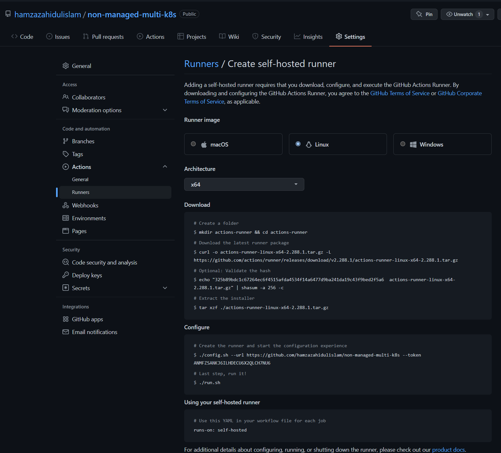</a>

## Configuring the self-hosted runner application as a service

Install the service with the following command:

    sudo ./svc.sh install

Start the service with the following command:

    sudo ./svc.sh start

Check the status of the service with the following command:

    sudo ./svc.sh status

_this is details_

[You can configure the self-hosted runner application as a service to automatically start the runner application when the machine starts.](https://docs.github.com/en/actions/hosting-your-own-runners/configuring-the-self-hosted-runner-application-as-a-service)

# deploy the application on the Master Node

**_now you configured your ci cd completely, you push your code on github_**
